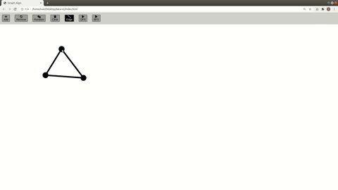
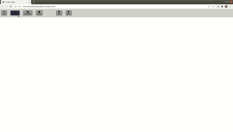
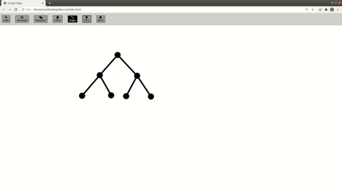
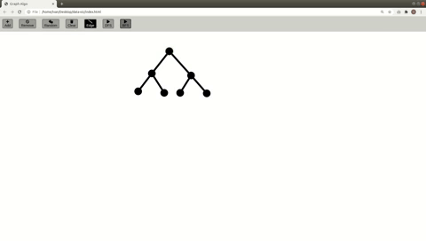

# Graph algorithm simulator

This will aim to visualize the execution of some graph algorithms from graphs that are either created customly or randomly generated.

## Creating graphs
- Graphs can be created by adding nodes and selecting them to add edges. If a node is erased all the edges connected to it will be erased. 
  * 
- Graphs can be created by using a random graph generator. Simply click the random button. Any graph that is displayed in the screen can be deleted by pressing clear.  
  * 
## Traversing Graphs
As of now there are only two algorithms implemented DFS(depth-first search) and BFS(breadth-first search)
- DFS example 
  * 
- BFS example  
  * 
